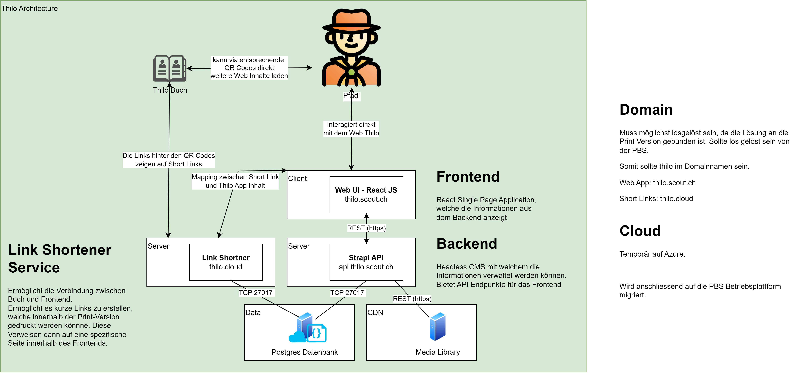

# Thilo

Schweizer Pfadibüchlein Thilo, das Original.

The Thilo contains a lot of interesting and useful information about the Scouts and belongs on every Scout's bedside table and in his or her bag. Contents: The scout movement, the world we live in, scout techniques, first aid, nature and the environment, camp life, etc.

## Archictrecture

## Available Scripts

In the project directory, you can run:

### `yarn start`

Runs the app in the development mode.\
Open [http://localhost:3000](http://localhost:3000) to view it in the browser.

### `yarn test`

Launches the test runner in the interactive watch mode.\
See the section about [running tests](https://facebook.github.io/create-react-app/docs/running-tests) for more information.

### `yarn build`

Builds the app for production to the `build` folder.\
It correctly bundles React in production mode and optimizes the build for the best performance.

## Contribute

Willst du mithelfen oder hast einen Verbesserungsvorschlag?
Schaue dir die Issues an oder erstelle ein Neues.
Wir freuen uns über jeden PR.
Bei Fragen kannst du dich an die Betreuungskommission (inhaltlich) oder die IT Kommission (technisch) wenden.
